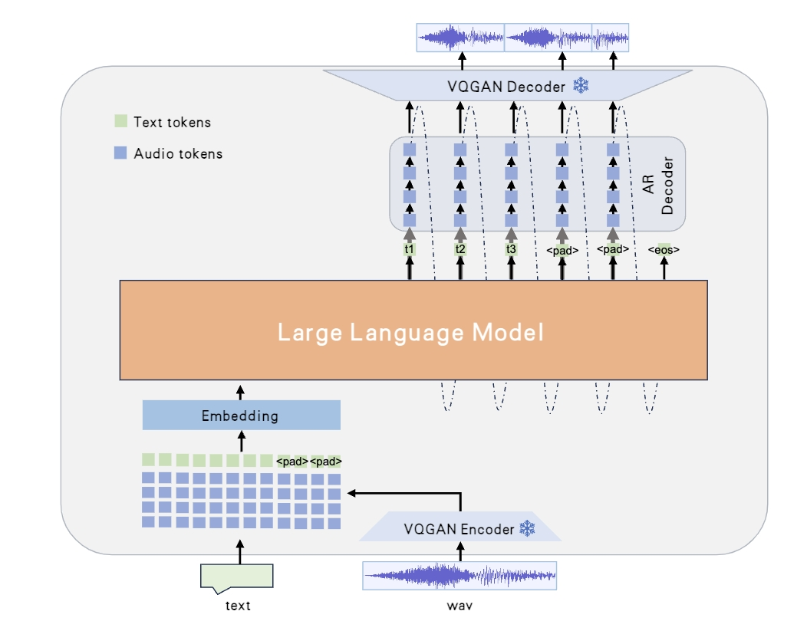

# Westlake-Omni

<p align="center"><strong style="font-size: 18px;">
Westlake-Omni: Open-Source Chinese Emotional Speech Interaction Large Language Model with Unified Discrete Sequence Modeling
</strong>
</p>

<p align="center">
🤗 <a href="https://huggingface.co/xinchen-ai/Westlake-Omni">Hugging Face</a>   | 📖 <a href="https://github.com/xinchen-ai/Westlake-Omni">Github</a> 
</p>

Westlake-Omni is an open-source Chinese emotional speech interaction large language model that utilizes discrete representations to achieve unified processing of speech and text modalities. The model supports low-latency generation and high-quality Chinese emotional speech interaction.

<p align="center">
    
</p>


## Highlights

🎙️ **Utilizes discrete representations to unify the processing of speech and text modalities.**.

🎭 **Trained on a high-quality Chinese emotional speech dataset, enabling native emotional speech interaction in Chinese.**

⚡ **Low-latency speech interaction, simultaneously generating text and speech responses.**

https://github.com/user-attachments/assets/02a71c01-3384-4845-8e7f-4e0dda35d8f3


## Install

Create a new conda environment and install the required packages:

```sh
conda install pytorch==2.3.0 torchvision==0.18.0 torchaudio==2.3.0 -c pytorch

git clone git@github.com:xinchen-ai/Westlake-Omni.git
cd Westlake-Omni
pip install -r requirements.txt
```

## Quick start

**Interactive demo**

- run gradio demo
```sh
python gradio_demo.py
```

**Local test**

- cli
```sh
python generate.py --user-audio data/sounds/input.wav --user-text 嗯，最近心情不是很好，能聊聊吗？
python generate.py --user-audio data/sounds/input.wav
```


## Acknowledgements 

- [fish-speech](https://github.com/fishaudio/fish-speech) The codebase we built upon.
- [Qwen2](https://github.com/QwenLM/Qwen2/) as the LLM backbone.

## Lincese
The current code and the vqgan model weights are provided under the CC-BY-NC-SA-4.0 License. The large language model weights are provided under the Apache 2.0 License. Note that parts of this code are based on Fish speech, released under the CC-BY-NC-SA-4.0 License.

## Contact
If you have any questions, please raise an issue or contact us at [service@xinchenai.com](service@xinchenai.com).

## Star History
[](https://star-history.com/#xinchen-ai/Westlake-Omni&Date)

